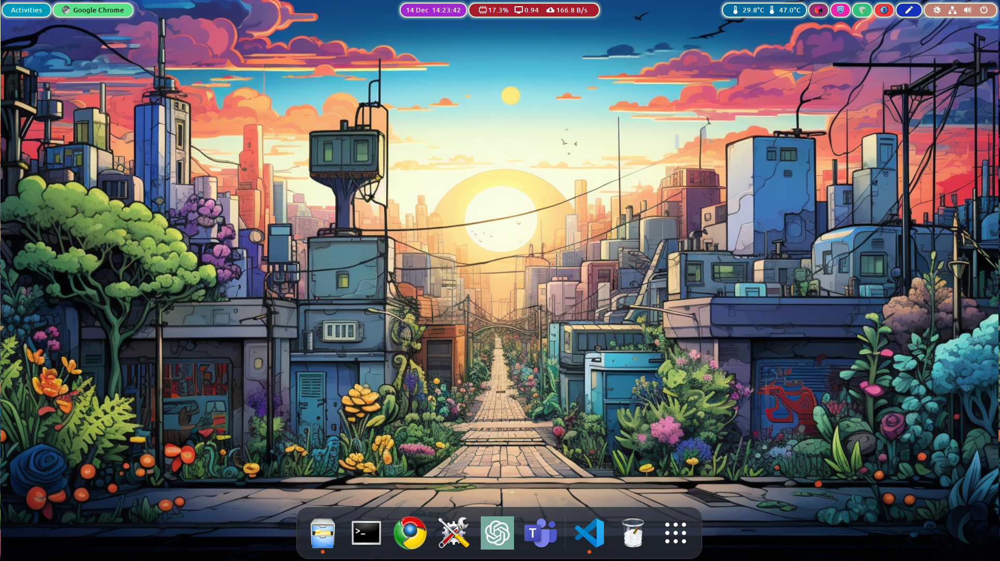
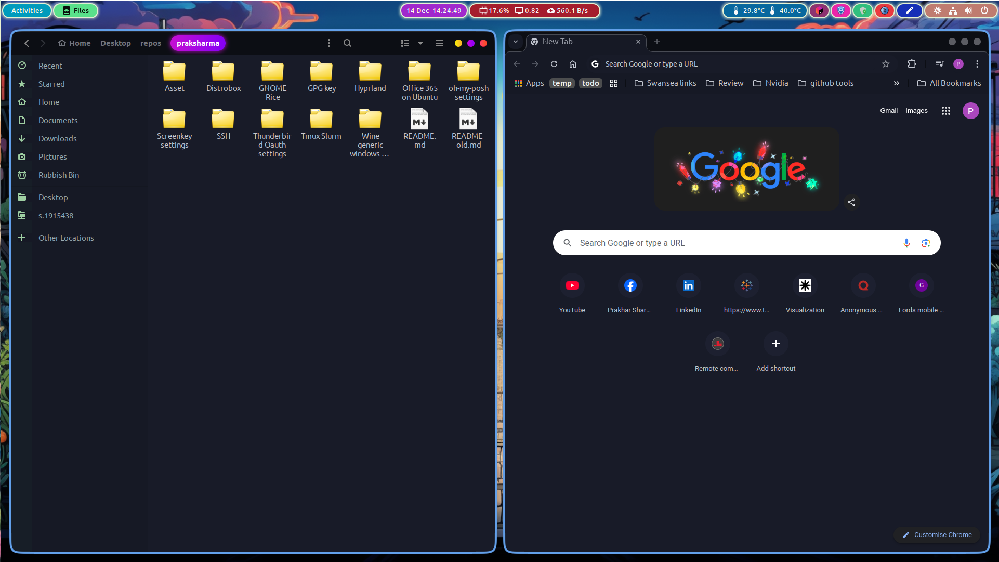

Screenshots:

Extensions:
* [Blur my shell](https://github.com/aunetx/blur-my-shell) (Doesn't play nicely with NVIDIA GPU)
* [Burn my window](https://github.com/Schneegans/Burn-My-Windows) : Hexagon and Incinerate effects
* [Rounded windows corners](https://github.com/yilozt/rounded-window-corners): 
    * Border width = -4.0
    * Border colour = Blue (Row 2, column 1)
    * Border radius = 12.0
    * Corner smoothing = 0.4
* [Dash to dock](https://micheleg.github.io/dash-to-dock/): Customise opacity: fixed, Opacity: 75%
* [Freon](https://github.com/UshakovVasilii/gnome-shell-extension-freon)
* [Open bar](https://github.com/neuromorph/openbar): 
    * Bar background > Box/Margins Alpha = 0, BG Alpha = 0. 
    * Bar background > Apply Candybar Pallete
    * Top bar properties > Type of bar: Islands

This will create a nice segmented colorful top bar.

* [Useless Gaps](https://github.com/mipmip/gnome-shell-extensions-useless-gaps): Gap size = 20, Uncheck "No Gaps for maximized windows"

* [User themes](https://gitlab.gnome.org/GNOME/gnome-shell-extensions): Preinstalled
* [Vitals](https://github.com/corecoding/Vitals): Position in panel: Center
* [Ubuntu AppIndicators](https://github.com/ubuntu/gnome-shell-extension-appindicator): For VPN, OBS icons in system tray
* [Notes](https://github.com/maoschanz/notes-extension-gnome)

Appearance Tweaks:
* Applications: [Sweet-Dark v40](https://www.gnome-look.org/p/1253385/)
* Cursor: [Windows Vista cursor](https://www.gnome-look.org/p/2061622)
* Icons: [Oxylite](https://www.gnome-look.org/p/2055724)
* Shell: [Graphite-teal-Dark-nord-Outlined](https://www.gnome-look.org/p/2014493/)
* Sound: [Windows 7](https://www.gnome-look.org/p/1149365)

Wallpaper: See wallpapers folder