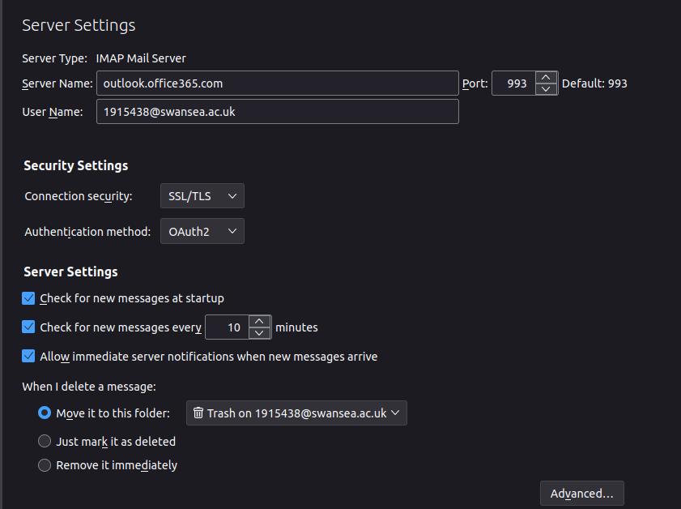
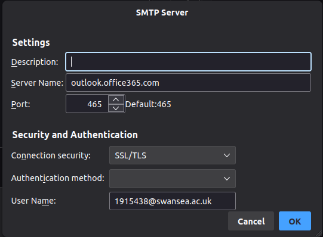
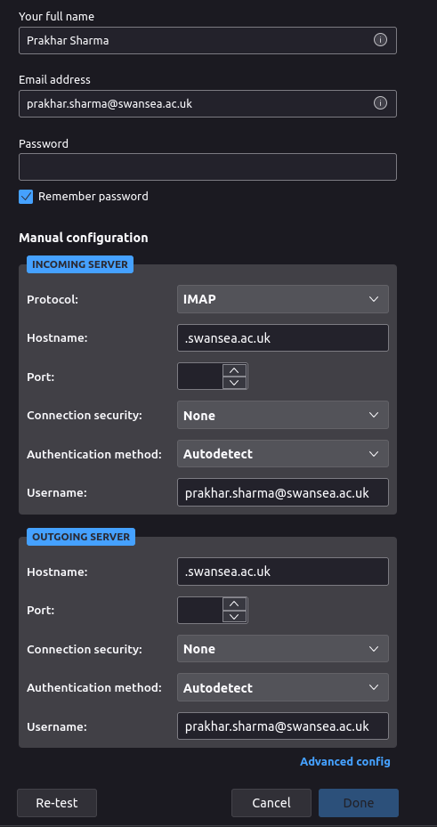

# Thuinderbird with oAuth2
The Oauth never worked for me on Thunderbird until recently. Sure there is a paid extension, but hey who will pay to read emails?

## Incoming server settings

## Outgoing server settings

## How to enter these settings
When adding an existing password, click on the manual config button and then click on advanced config. Then you can enter these settings.

There are still some hicups. For example, the calender does not work. I can't schedule a meeting or book a room from thunderbird.

EDIT:
Mozilla created a [comprehensive blog](https://support.mozilla.org/en-US/kb/microsoft-oauth-authentication-and-thunderbird-202) on setting up Microsoft Oauth2 accounts.