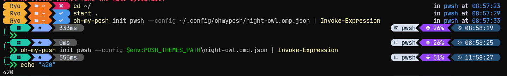
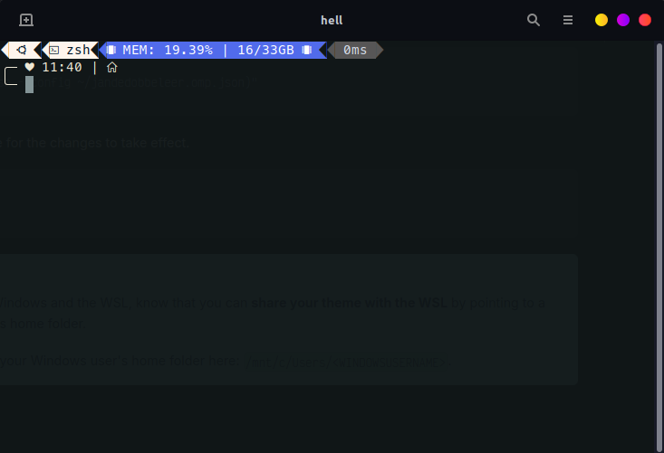
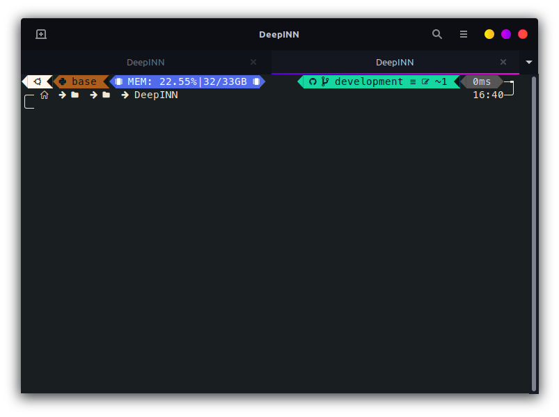

# oh-my-posh settings

All the installation instruction are given [here](https://ohmyposh.dev/docs/installation/linux).

* Download the executable at `~/.oh-my-posh`.
    * `curl -s https://ohmyposh.dev/install.sh | bash -s -- -d ~/bin`
* Add the executable to the path. The command is in the `.zshrc` file. And then reload the shell using `exec zsh`
* Install Meslo fonts from the list.
    * `oh-my-posh font install`
* Put oh-my-posh script in `.zshrc`.
    * `eval "$(oh-my-posh init zsh --config ~/jandedobbeleer.omp.json)"`

You should see the default oh-my-posh theme.



## Changing the theme
One can use native theme or 3rd party themes. All native themes are found [here](https://github.com/JanDeDobbeleer/oh-my-posh/tree/main/themes). We can just download this themes folder using [DownGit](https://minhaskamal.github.io/DownGit).

[Here](https://ohmyposh.dev/docs/themes) is a list of all the native themes with their visual appearance. I like the [clean-detailed](https://ohmyposh.dev/docs/themes#clean-detailed) theme. So i just copy the name "clean-detailed" from the webpage and paste it here:

```sh
eval "$(oh-my-posh init zsh --config ~/.oh-my-posh/themes/clean-detailed.omp.json)"
```

Reload the shell:
```sh
exec zsh
```


# My custom theme
So, I created a custom oh-my-posh theme. Here is how it looks like.

